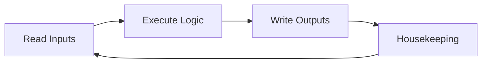
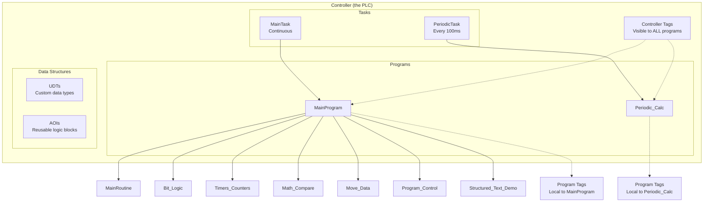

# Studio 5000 Beginner Study Guide — Part Inspection Station

> **Companion file**: `Beginner_Guide.L5X` (import this into Studio 5000 to follow along)
> **Estimated time**: 4–6 hours to read and practice all concepts
> **Prerequisites**: Windows PC, Studio 5000 v32+ installed (any edition), no PLC hardware needed

---

## Table of Contents

1. [What is Studio 5000?](#1-what-is-studio-5000)
2. [Opening the Beginner Project](#2-opening-the-beginner-project)
3. [The Studio 5000 Interface](#3-the-studio-5000-interface)
4. [Concept Map: How Everything Connects](#4-concept-map-how-everything-connects)
5. [Walkthrough: Creating This Project From Scratch](#5-walkthrough-creating-this-project-from-scratch)
   - [5.1 Create a New Project](#51-create-a-new-project)
   - [5.2 Create a User-Defined Data Type (UDT)](#52-create-a-user-defined-data-type-udt)
   - [5.3 Create Controller-Scoped Tags](#53-create-controller-scoped-tags)
   - [5.4 Create an Add-On Instruction (AOI)](#54-create-an-add-on-instruction-aoi)
   - [5.5 Create Programs and Routines](#55-create-programs-and-routines)
   - [5.6 Write Ladder Logic Rungs](#56-write-ladder-logic-rungs)
   - [5.7 Write Structured Text](#57-write-structured-text)
   - [5.8 Configure Tasks](#58-configure-tasks)
   - [5.9 Configure Trends](#59-configure-trends)
6. [Concept Deep-Dives](#6-concept-deep-dives)
   - [6.1 Bit Logic](#61-bit-logic)
   - [6.2 Timers](#62-timers)
   - [6.3 Counters](#63-counters)
   - [6.4 Math Instructions](#64-math-instructions)
   - [6.5 Comparison Instructions](#65-comparison-instructions)
   - [6.6 Move and Data Instructions](#66-move-and-data-instructions)
   - [6.7 Program Control Instructions](#67-program-control-instructions)
   - [6.8 UDTs (User-Defined Data Types)](#68-udts-user-defined-data-types)
   - [6.9 AOIs (Add-On Instructions)](#69-aois-add-on-instructions)
   - [6.10 Tasks (Continuous vs Periodic)](#610-tasks-continuous-vs-periodic)
   - [6.11 Tag Scope](#611-tag-scope)
   - [6.12 Structured Text](#612-structured-text)
   - [6.13 Trends](#613-trends)
7. [Common Mistakes and How to Avoid Them](#7-common-mistakes-and-how-to-avoid-them)
8. [Practice Exercises](#8-practice-exercises)
9. [Cheat Sheet](#9-cheat-sheet)

---

## 1. What is Studio 5000?

Studio 5000 is **Rockwell Automation's programming software** for Allen-Bradley ControlLogix and CompactLogix PLCs. It is the industry standard for factory automation in North America.

Think of it as an **IDE (Integrated Development Environment)** for industrial controllers — like Visual Studio Code, but for machines instead of apps.

### What a PLC Does

A PLC (Programmable Logic Controller) runs a continuous loop called the **scan cycle**:



This loop repeats endlessly — typically every 1–20 milliseconds. Your logic runs **every scan**.

### The Five Languages

Studio 5000 supports five IEC 61131-3 languages:

| Language | What It Is | Best For |
|---|---|---|
| **Ladder Logic (RLL)** | Graphical, looks like electrical schematics | Boolean logic, machine sequencing, maintenance techs |
| **Structured Text (ST)** | Text-based, like Pascal/C | Complex math, string handling, state machines |
| **Function Block Diagram (FBD)** | Graphical blocks with wires | PID loops, signal processing, drive control |
| **Sequential Function Chart (SFC)** | Flowchart-like steps | Batch processes, state-driven sequences |
| **Ladder Diagram (LD)** | IEC variant of Ladder Logic | Same as RLL |

This guide focuses on **Ladder Logic** (the most common) with a **Structured Text** example.

---

## 2. Opening the Beginner Project

### Option A: Open the L5X file directly

1. Launch **Studio 5000 Logix Designer**
2. Click **File → Open**
3. Browse to `Beginner_Guide.L5X` and select it
4. Studio 5000 will open the project. You do NOT need to connect to a physical PLC.

### Option B: Import into an existing project

1. Open any `.ACD` project
2. Right-click the program folder → **Import Component → Routine**
3. Or: **File → Import → Project Components** for tags/UDTs/AOIs

### What You'll See

After opening, you'll see the **Controller Organizer** (the tree on the left) with:
- **Controller Beginner_Guide** (the PLC)
  - Controller Tags
  - Controller Fault Handler
  - Power-Up Handler
  - **Tasks**
    - MainTask
      - MainProgram
        - Program Tags
        - **MainRoutine** ← entry point
        - Bit_Logic
        - Timers_Counters
        - Math_Compare
        - Move_Data
        - Program_Control
        - Structured_Text_Demo
    - PeriodicTask
      - Periodic_Calc
        - Program Tags
        - Periodic_Routine
  - **Trends**
    - ProductionTrend
    - OEE_Trend
  - **Data Types**
    - udtPartRecord
    - udtMotorStarter
  - **Add-On Instructions**
    - aoiMotorStarter

---

## 3. The Studio 5000 Interface

```
┌──────────────────────────────────────────────────────────┐
│  Menu Bar (File, Edit, View, Search, Logic, ...)         │
├──────────┬───────────────────────────────────────────────┤
│          │  Language Element Toolbar (contacts, coils,   │
│          │  timers, math — drag onto rungs)              │
│ Controller│───────────────────────────────────────────────┤
│ Organizer│                                               │
│ (tree)   │  LADDER EDITOR WINDOW                         │
│          │  ┌──────────────────────────────────┐         │
│          │  │ Rung 0: [XIC]──[XIO]──(OTE)     │         │
│          │  │ Comment: Seal-in circuit         │         │
│          │  ├──────────────────────────────────┤         │
│          │  │ Rung 1: [XIC]──(OTL)            │         │
│          │  │ Comment: Latch alarm            │         │
│          │  └──────────────────────────────────┘         │
│          │                                               │
│          ├───────────────────────────────────────────────┤
│          │  Results / Errors / Watch Pane                │
└──────────┴───────────────────────────────────────────────┘
```

### Key Areas

| Area | What You Do There |
|---|---|
| **Controller Organizer** (left tree) | Navigate between tags, programs, routines, tasks, I/O |
| **Language Element Toolbar** (top of editor) | Drag instructions onto rungs |
| **Ladder Editor** (center) | Write and edit ladder logic |
| **Tag Browser** (popup when typing tag names) | Browse and select tags |
| **Results Window** (bottom) | Verify (compile) errors, search results |
| **Watch Pane** (bottom/right) | Monitor live tag values (only when online) |

---

## 4. Concept Map: How Everything Connects



**Key relationships:**
- A **Controller** contains **Tasks**, **Tags**, **Data Types**, and **Trends**
- A **Task** schedules one or more **Programs**
- A **Program** contains **Routines** and local **Program Tags**
- A **Routine** contains **Rungs** (ladder) or **Statements** (structured text)
- **Controller Tags** are visible everywhere; **Program Tags** only within their program
- **UDTs** define custom data structures you can use in tags
- **AOIs** are reusable logic blocks (like functions) with parameters

---

## 5. Walkthrough: Creating This Project From Scratch

This section shows you how to build the `Beginner_Guide` project step by step. Follow along in Studio 5000.

### 5.1 Create a New Project

1. Open Studio 5000
2. Click **New Project**
3. Choose your controller type:
   - **Family**: ControlLogix
   - **Type**: 1756-L72 (or any available controller)
   - **Name**: `Beginner_Guide`
   - **Revision**: 32 or higher
4. Click **Next → Finish**

**Result**: An empty project with `MainProgram` and `MainRoutine`.

---

### 5.2 Create a User-Defined Data Type (UDT)

UDTs let you group related data into a single reusable structure — like a `struct` in C or a `class` in Python (data-only).

#### Create `udtPartRecord`:

1. In the Controller Organizer, right-click **Data Types → User-Defined**
2. Select **New Data Type...**
3. Fill in:
   - **Name**: `udtPartRecord`
   - **Description**: "Part inspection record"
4. Add members (type in the grid):

   | Name | Data Type | Description |
   |---|---|---|
   | `PartID` | DINT | Unique part identifier |
   | `Weight` | REAL | Measured weight (grams) |
   | `TargetWeight` | REAL | Target specification |
   | `Tolerance` | REAL | Acceptable +/- grams |
   | `InspectionResult` | DINT | 0=Pending, 1=Pass, 2-4=Fail |
   | `InspectionTime_ms` | DINT | Inspection duration (ms) |
   | `Timestamp` | DINT[7] | Y/M/D/H/M/S/MS array |

5. Click **OK**

#### Create `udtMotorStarter`:

Repeat with these members:

| Name | Data Type | Description |
|---|---|---|
| `RunCommand` | BOOL | Run command from logic |
| `Running` | BOOL | Feedback: motor running |
| `Faulted` | BOOL | Fault detected |
| `OverloadTrip` | BOOL | Overload protection |
| `RunHours` | REAL | Accumulated hours |
| `StartCount` | DINT | Number of starts |
| `FaultCode` | DINT | 0=OK 1=Overload 2=Timeout |

**Key concept**: Once a UDT exists, you can create tags of that type. For example, `CurrentPart` is a tag of type `udtPartRecord`, and its members are accessed with dot notation: `CurrentPart.Weight`, `CurrentPart.InspectionResult`.

---

### 5.3 Create Controller-Scoped Tags

Controller tags are visible from ALL programs. Program tags are only visible within their specific program.

1. In the Controller Organizer, double-click **Controller Tags**
2. The **Tag Editor** opens at the bottom — it looks like a spreadsheet
3. Click the **Edit Tags** tab
4. Add each tag row by typing in the Name, Data Type, and optionally a Description:

#### Digital (BOOL) Tags

| Name | Data Type | Description |
|---|---|---|
| `StartPB` | BOOL | Start pushbutton |
| `StopPB` | BOOL | Stop pushbutton |
| `EmergencyStop` | BOOL | E-Stop (NC) |
| `PartSensor` | BOOL | Part present sensor |
| `GateClosed` | BOOL | Safety gate |
| `ResetPB` | BOOL | Reset button |
| `ManualMode` | BOOL | Manual mode select |
| `AutoMode` | BOOL | Auto mode select |
| `SystemReady` | BOOL | System OK |
| `SystemPowered` | BOOL | Power on |
| `MachineActive` | BOOL | Mode active |
| `CycleActive` | BOOL | Cycle in progress |
| `CycleComplete` | BOOL | Cycle finished |
| `ConveyorRun` | BOOL | Conveyor command |
| `PartDetectedONS` | BOOL | ONS storage bit |
| `AlarmLatched` | BOOL | Latched alarm |
| `SkipSection` | BOOL | Debug skip flag |

#### Integer (DINT) Tags

| Name | Data Type | Initial Value |
|---|---|---|
| `PartCount` | DINT | 0 |
| `GoodParts` | DINT | 0 |
| `RejectParts` | DINT | 0 |
| `BatchSize` | DINT | 100 |
| `ShiftTarget` | DINT | 500 |
| `PartWeightRaw` | DINT | 0 |
| `ForLoopIndex` | DINT | 0 |
| `CalculatedResult` | DINT | 0 |

#### Real (REAL) Tags

| Name | Data Type | Initial Value |
|---|---|---|
| `PartWeight` | REAL | 0.0 |
| `TargetWeight` | REAL | 250.0 |
| `WeightTolerance` | REAL | 5.0 |
| `ProductionRate` | REAL | 0.0 |
| `OEE_Availability` | REAL | 0.0 |
| `OEE_Performance` | REAL | 0.0 |
| `OEE_Quality` | REAL | 0.0 |
| `DeviationValue` | REAL | 0.0 |

#### Timer Tags

| Name | Data Type |
|---|---|
| `InspectionDelay` | TIMER |
| `InspectionWindow` | TIMER |
| `ConveyorRunOff` | TIMER |
| `ShiftRunTime` | TIMER |
| `HealthCheckTimer` | TIMER |

#### Counter Tags

| Name | Data Type |
|---|---|
| `TotalPartCounter` | COUNTER |
| `BatchRemaining` | COUNTER |
| `GoodPartCounter` | COUNTER |

#### UDT Tags

| Name | Data Type |
|---|---|
| `CurrentPart` | udtPartRecord |
| `ConveyorMotor` | udtMotorStarter |
| `FanMotor` | udtMotorStarter |

#### Array Tags

To create an array tag, type the **dimension** in brackets:

| Name | Data Type | Notes |
|---|---|---|
| `PartHistory` | udtPartRecord[50] | 50-element array of part records |
| `HourlyCount` | DINT[24] | 24-element integer array |
| `ShiftReportData` | REAL[8] | 8-element real array |

**How to type array dimensions**: In the Data Type column, type `udtPartRecord[50]` — this creates an array with indices 0–49.

#### Constant Tags

| Name | Data Type | Value | Constant? |
|---|---|---|---|
| `MAX_PARTS_PER_BATCH` | DINT | 1000 | Yes |
| `SECONDS_PER_HOUR` | REAL | 3600.0 | Yes |

**Make a tag constant**: In the tag editor, find the **Constant** column and set it to `Yes`. Constant tags cannot be written to at runtime — they're immutable.

---

### 5.4 Create an Add-On Instruction (AOI)

An AOI is like a **function** or **reusable subroutine** that you can call many times with different parameters. This project's `aoiMotorStarter` encapsulates a complete motor start/stop/fault pattern so you can reuse it for any motor.

#### Step 1: Create the AOI Definition

1. In the Controller Organizer, right-click **Add-On Instructions**
2. Select **New Add-On Instruction...**
3. Fill in:
   - **Name**: `aoiMotorStarter`
   - **Description**: "Reusable motor starter with fault handling"
   - **Language**: Ladder Diagram

#### Step 2: Define Parameters

Click the **Parameters** tab and add:

| Name | Usage | Data Type | Required | Description |
|---|---|---|---|---|
| `EnableIn` | Input | BOOL | No | System — keep visible=false |
| `EnableOut` | Output | BOOL | No | System — keep visible=false |
| `Start` | Input | BOOL | Yes | Rising edge starts motor |
| `Stop` | Input | BOOL | Yes | Rising edge stops motor |
| `FaultReset` | Input | BOOL | Yes | Rising edge clears fault |
| `FeedbackRun` | Input | BOOL | Yes | Contactor aux contact |
| `Overload` | Input | BOOL | Yes | Overload relay |
| `FeedbackTimeout_ms` | Input | DINT | Yes | Max wait for feedback |
| `Running` | Output | BOOL | Yes | Motor running status |
| `Faulted` | Output | BOOL | Yes | Fault status |
| `Status` | InOut | udtMotorStarter | Yes | Backing UDT tag |

**Usage types explained:**
- **Input**: Value flows INTO the AOI (read-only inside)
- **Output**: Value flows OUT of the AOI (write-only inside)
- **InOut**: Value flows BOTH ways (read-write, must be a tag reference)

#### Step 3: Add Local Tags

Click the **Local Tags** tab and add:

| Name | Data Type | Description |
|---|---|---|
| `FeedbackTimer` | TIMER | Feedback timeout timer |
| `StartONS` | BOOL | One-shot storage |
| `RunHourTimer` | TIMER | 1-second pulse timer |
| `HourAccum` | REAL | Fractional hour accumulator |

Local tags exist ONLY inside the AOI. Each instance gets its own copy.

#### Step 4: Write the AOI Logic

Double-click the `Logic` routine under the AOI definition. Write these rungs:

**Rung 0 — Seal-in circuit with one-shot start:**
```
XIC(Start) ONS(StartONS) BST XIC(Status.RunCommand) NXB XIC(StartONS) BND XIO(Stop) XIO(Faulted) OTE(Status.RunCommand)
```
*The BST/NXB/BND create a parallel branch (OR) for the seal-in.*

**Rung 1 — Feedback timeout:**
```
XIC(Status.RunCommand) XIO(FeedbackRun) TON(FeedbackTimer,FeedbackTimeout_ms,?)
```

**Rung 2 — Running status:**
```
XIC(Status.RunCommand) XIC(FeedbackRun) OTE(Running)
```

**Rung 3 — Fault latch (parallel branches for multiple fault sources):**
```
BST XIC(Overload) NXB XIC(FeedbackTimer.DN) NXB XIC(Status.Faulted) BND OTL(Faulted)
```

**Rung 4 — Fault code 1 (overload):**
```
XIC(Overload) MOV(1,Status.FaultCode)
```

**Rung 5 — Fault code 2 (feedback timeout):**
```
XIC(FeedbackTimer.DN) MOV(2,Status.FaultCode)
```

**Rung 6 — Fault reset:**
```
XIC(FaultReset) OTU(Faulted) MOV(0,Status.FaultCode)
```

#### Step 5: Using the AOI in MainRoutine

The AOI is called like a function:
```
aoiMotorStarter(ConveyorMotor, StartPB, StopPB, ResetPB,
                ConveyorRun, EmergencyStop, 2000,
                ConveyorRun, AlarmLatched, ConveyorMotor)
```

Each parameter maps to an AOI parameter in declaration order. The first and last parameters are the EnableIn/EnableOut and the InOut backing tag.

---

### 5.5 Create Programs and Routines

#### Add a Second Program (Periodic_Calc)

1. Right-click **Tasks → MainTask** (or any task)
2. **Add New Program...**
3. Name: `Periodic_Calc`
4. A new program appears with one empty routine

#### Add Routines to MainProgram

1. Right-click **MainProgram** in the Controller Organizer
2. **Add → New Routine...**
3. Enter the name and choose the type:
   - `Bit_Logic` — Type: **Ladder Diagram**
   - `Timers_Counters` — Type: **Ladder Diagram**
   - `Math_Compare` — Type: **Ladder Diagram**
   - `Move_Data` — Type: **Ladder Diagram**
   - `Program_Control` — Type: **Ladder Diagram**
   - `Structured_Text_Demo` — Type: **Structured Text**
4. Repeat for each routine

---

### 5.6 Write Ladder Logic Rungs

#### How to Add a Rung

1. Open a routine (e.g., `MainRoutine`)
2. Click the **Add Rung** button in the toolbar (or right-click → **Add Rung**)
3. A new empty rung appears with a `?` placeholder

#### How to Add Instructions

**Method A — Drag from the toolbar:**
1. Click the **Favorites** or instruction category tab (above the ladder editor)
2. Drag the instruction onto the rung

**Method B — Type the mnemonic:**
1. Click on the rung
2. Type the instruction mnemonic (e.g., `XIC`, `OTE`, `TON`)
3. Press Enter

**Method C — Right-click the rung element:**
1. Right-click a `?` placeholder
2. Select **Add Element** or the specific instruction

#### How to Assign Tags

After adding an instruction, a tag name field appears:
1. Double-click the tag field
2. Start typing the tag name — autocomplete appears
3. Select from the dropdown, or type a new name and press Enter
4. If the tag doesn't exist, right-click and **New Tag...**

#### How to Create Branches (OR Logic)

1. Click on the rung where you want a branch
2. Right-click → **Add Branch** (or click the branch icon in the toolbar)
3. Branches appear as parallel paths
4. Add instructions inside each branch

#### Writing the JSR Rungs in MainRoutine

The `MainRoutine` uses **JSR** (Jump to Subroutine) to call each concept routine in order:

```
Rung 0: JSR(Bit_Logic, 0, 0)
```
- `Bit_Logic` = routine name to call
- First `0` = number of input parameters (none in this case)
- Second `0` = number of return parameters (none in this case)

Repeat for `Timers_Counters`, `Math_Compare`, `Move_Data`, `Program_Control`.

For AOI calls:
```
Rung 5: aoiMotorStarter(ConveyorMotor, StartPB, StopPB, ResetPB, ConveyorRun, EmergencyStop, 2000, ConveyorRun, AlarmLatched, ConveyorMotor)
```
This is a **function block call** — the AOI name followed by parameters in parentheses.

For calling Structured Text from Ladder:
```
Rung 7: JSR(Structured_Text_Demo, 0, 0)
```
JSR works for ANY routine type — ladder can call ST, ST can call ladder.

---

### 5.7 Write Structured Text

1. Open `Structured_Text_Demo`
2. The editor switches to a text editor with syntax highlighting
3. Type ST code directly

#### Key ST Syntax

```
(* Multi-line comment *)

// Single-line comment

Tag := value;                         // Assignment (like MOV)
IF condition THEN ... END_IF;         // Conditional
CASE selector OF ... END_CASE;        // Multi-way branch
FOR i := 0 TO 23 BY 1 DO ... END_FOR; // Loop
```

**Critical difference**: In ST, you use `:=` for assignment (not `=`). `=` is ONLY for comparison in expressions.

Example — the same logic in both languages:

| Ladder | Structured Text |
|---|---|
| `XIC(PartSensor) OTE(ConveyorRun);` | `IF PartSensor THEN ConveyorRun := 1; ELSE ConveyorRun := 0; END_IF;` |
| `ADD(A, B, C);` | `C := A + B;` |
| `EQU(X, 10) OTE(Y);` | `Y := (X = 10);` |

---

### 5.8 Configure Tasks

Tasks control **WHEN** programs execute.

#### MainTask (already exists)

1. Right-click **MainTask → Properties**
2. **Type**: Continuous (runs as fast as possible)
3. **Watchdog**: 500 ms (if scan exceeds this, the PLC faults)
4. Under **Program/Phase Schedule**, ensure **MainProgram** is listed

#### Create PeriodicTask

1. Right-click **Tasks → Add New Task...**
2. Fill in:
   - **Name**: `PeriodicTask`
   - **Type**: Periodic
   - **Period**: 100 ms (executes every 100 milliseconds)
   - **Priority**: 5 (lower number = higher priority; the periodic task interrupts the continuous task)
   - **Watchdog**: 100 ms
3. Click **OK**
4. Right-click **PeriodicTask → Add New Program...**
5. Name it `Periodic_Calc`

#### Task Types Explained

| Type | Behavior | Use Case |
|---|---|---|
| **Continuous** | Runs MainProgram endlessly. When one scan finishes, the next begins. | Main logic, sequencing, HMI interface |
| **Periodic** | Runs at fixed intervals (e.g., every 100ms). Interrupts continuous task. | PID loops, motion control, fast calculations |
| **Event** | Runs only when a trigger event occurs (e.g., input change, consumed tag). | High-speed responses, specific triggers |

**Priority rule**: Lower number = higher priority. A priority-5 periodic task will interrupt a priority-10 continuous task mid-scan, run completely, then return control.

---

### 5.9 Configure Trends

Trends are like a built-in oscilloscope — they plot tag values over time.

1. Right-click **Trends → New Trend...**
2. Name: `ProductionTrend`
3. In the **Trend Configuration** tab:
   - **Sample Period**: 1000 ms (sample every second)
   - **Maximum Points**: 3600 (1 hour of data)
   - Add pens:
     - Pen 0: Tag `ProductionRate`, Color Red
     - Pen 1: Tag `PartCount`, Color Blue
     - Pen 2: Tag `GoodParts`, Color Green
4. Repeat for `OEE_Trend` with OEE tags

To view trends, double-click the trend name. You'll see a chart window. Click **Start** to begin capturing (only works when online with a controller).

---

## 6. Concept Deep-Dives

### 6.1 Bit Logic

Bit logic is the foundation of all PLC programming. It deals with **binary values** — things that are either ON (1) or OFF (0).

#### The Five Core Instructions

```
Instruction  Symbol    What It Does
─────────────────────────────────────────────
XIC          ─] [─     TRUE if tag = 1 (normally-open contact)
XIO          ─]/[─     TRUE if tag = 0 (normally-closed contact)
OTE          ─( )─     Sets tag to match rung condition (coil)
OTL          ─(L)─     Sets tag to 1 and holds it (latch)
OTU          ─(U)─     Sets tag to 0 (unlatch)
```

#### XIC vs XIO — The Most Confusing Part for Beginners

```
XIC(Tag)  =  "Examine If Closed"  =  TRUE when Tag is 1
XIO(Tag)  =  "Examine If Open"    =  TRUE when Tag is 0
```

The names come from electrical relay logic:
- XIC = the relay contact is CLOSED (conducting) when the coil is energized
- XIO = the relay contact is CLOSED (conducting) when the coil is NOT energized

**Practical rule**: 
- Use XIC for "I want this condition to be TRUE"
- Use XIO for "I want this condition to be FALSE" (negation, safety checks)

**Safety example**: `XIO(EmergencyStop)` is the standard safety pattern. E-Stop is wired as normally-closed, so when NOT pressed, the input reads 1. XIO gives TRUE when input=0, so the rung is TRUE when E-Stop is NOT pressed (safe state). If a wire breaks (input→0), XIO becomes TRUE too, but the safety chain should handle this — the XIO is a layer of defense, not the primary safety.

#### OTE vs OTL/OTU

| | OTE | OTL / OTU |
|---|---|---|
| **Behavior when rung is FALSE** | Tag → 0 | Tag stays at last state |
| **Behavior when rung is TRUE** | Tag → 1 | OTL: Tag → 1 (permanent). OTU: Tag → 0 |
| **Seal-in needed?** | Yes (parallel contact) | No (stays latched) |
| **Memory across power cycle?** | No | No (both reset on power-up unless retentive) |
| **Use for** | Normal outputs, indicators | Alarms that persist after condition clears, step states |

#### One-Shots (ONS, OSR, OSF)

A **one-shot** makes a signal TRUE for exactly **one scan** when a transition occurs.

```
ONS(StorageBit) — TRUE for 1 scan on FALSE→TRUE transition
OSF(StorageBit) — TRUE for 1 scan on TRUE→FALSE transition
OSR(StorageBit) — TRUE for 1 scan on FALSE→TRUE transition (same as ONS)
```

**Must use a unique storage bit** for each one-shot! The storage bit remembers the "previous" state. Don't reuse storage bits across different rungs.

**Use case**: `XIC(PartSensor) ONS(PartDetectONS) CTU(PartCounter,9999,?)` — counts each part exactly once, not every scan while the sensor is on.

#### Seal-In Circuit (Start/Stop Pattern)

```
  StartPB      StopPB     MotorRun
  ──] [─────────]/[────────( )──
    │                        │
    │   MotorRun             │
    └───] [──────────────────┘
```

- Pressing StartPB energizes MotorRun
- The MotorRun contact in parallel "seals in" — keeps MotorRun on after StartPB releases
- Pressing StopPB breaks the seal — MotorRun turns off

This is the single most common pattern in industrial automation.

---

### 6.2 Timers

Timers measure elapsed time. Studio 5000 has three timer types.

#### Timer Structure

Every TIMER tag has these sub-elements (accessed with dot notation):

| Element | Meaning |
|---|---|
| `.PRE` | Preset value (setpoint, in milliseconds) |
| `.ACC` | Accumulator value (current elapsed time) |
| `.EN` | Enabled (rung is TRUE, timer is active) |
| `.TT` | Timer Timing (rung is TRUE AND .ACC < .PRE) |
| `.DN` | Done (.ACC >= .PRE, timer has expired) |

#### TON — Timer On Delay

```
   Condition     TON          Condition.DN
  ──] [─────────[TON]───────────] [────
              Timer,Preset,?

  Timeline:    ___/‾‾‾‾‾‾‾‾‾‾‾‾‾\___
  Condition:   ___|‾‾‾‾‾‾‾‾‾‾‾‾‾|___
  .DN:         ________/‾‾‾‾‾‾‾‾‾‾‾‾
                        ← Preset →
```

**When Condition goes TRUE**, the timer starts counting. When `.ACC` reaches `.PRE`, `.DN` goes TRUE. When Condition goes FALSE, `.ACC` resets to 0 and `.DN` goes FALSE.

**Use case**: "Wait 2 seconds after part detected before starting inspection."

#### TOF — Timer Off Delay

```
   Condition     TOF
  ──] [─────────[TOF]────
              Timer,Preset,?

  Timeline:    ‾‾‾\___/‾‾‾‾‾‾‾‾‾‾‾
  Condition:   ‾‾‾|___|‾‾‾‾‾‾‾‾‾‾‾
  .DN:         ‾‾‾‾‾‾‾\___/‾‾‾‾‾‾‾‾‾
                        ←Preset→
```

**When Condition goes FALSE**, the timer starts counting. `.DN` stays TRUE while timing. When `.ACC` reaches `.PRE`, `.DN` goes FALSE.

**Use case**: "Keep conveyor running for 3 seconds after part clears the sensor."

#### RTO — Retentive Timer On

```
   Condition     RTO          RES
  ──] [─────────[RTO]────    [RES]
              Timer,Preset,?  Timer

  Timeline (across multiple TRUE periods):
  Condition:   _/‾\___/‾‾‾‾\___/‾‾\_
  .ACC:        0→1→1→2→3→4→4→5→6→6
  .DN:         _________/‾‾‾‾‾‾‾‾‾‾
```

**RTO does NOT reset when Condition goes FALSE**. The accumulator holds its value across FALSE periods. Only the RES instruction can reset it.

**Use case**: "Total shift run time" — keeps accumulating across many start/stop cycles. Reset at shift change.

#### Choosing the Right Timer

| Need | Use |
|---|---|
| "Wait X seconds after signal ON" | TON |
| "Keep output ON for X seconds after signal OFF" | TOF |
| "Track total accumulated time across many cycles" | RTO |
| Reset a timer | RES instruction |

---

### 6.3 Counters

Counters track how many times an event has occurred.

#### Counter Structure

| Element | Meaning |
|---|---|
| `.PRE` | Preset value |
| `.ACC` | Accumulator (current count) |
| `.CU` | Count Up enable (rung was TRUE on previous scan) |
| `.CD` | Count Down enable |
| `.DN` | Done (.ACC >= .PRE for CTU, .ACC <= 0 for CTD) |
| `.OV` | Overflow (.ACC wrapped past 2,147,483,647) |
| `.UN` | Underflow (.ACC wrapped past -2,147,483,648) |

#### CTU — Count Up

```
  Trigger        CTU
  ──] [─────────[CTU]────
              Counter,Preset,?

Each FALSE→TRUE transition increments .ACC by 1.
```

#### CTD — Count Down

```
  Trigger        CTD
  ──] [─────────[CTD]────
              Counter,Preset,?

Each FALSE→TRUE transition decrements .ACC by 1.
Preset sets the STARTING value.
```

#### Counter Overflow Protection

ALWAYS guard against overflow:
```
XIC(Counter.OV) OTL(AlarmBit) — stops the machine if counter wraps
XIC(Counter.OV) RES(Counter)  — reset if near overflow
```

DINT counters max out at ±2.1 billion. That may seem like a lot, but for a machine counting at 60 parts/minute, 24/7, it overflows in ~68 years. For faster events (1ms counts), it overflows in ~25 days. **Always protect against overflow.**

---

### 6.4 Math Instructions

#### Basic Arithmetic

| Instruction | Syntax | Operation |
|---|---|---|
| ADD | `ADD(A, B, Dest)` | Dest = A + B |
| SUB | `SUB(A, B, Dest)` | Dest = A - B |
| MUL | `MUL(A, B, Dest)` | Dest = A * B |
| DIV | `DIV(A, B, Dest)` | Dest = A / B |
| MOD | `MOD(A, B, Dest)` | Dest = A % B (remainder) |
| SQR | `SQR(A, Dest)` | Dest = √A |
| ABS | `ABS(A, Dest)` | Dest = |A| (absolute value) |
| NEG | `NEG(A, Dest)` | Dest = -A |

#### CPT — Compute (Expression Math)

Instead of chaining multiple math instructions:
```
SUB(PartWeight, TargetWeight, Deviation)
ABS(Deviation, Deviation)
DIV(Deviation, TargetWeight, DeviationPercent)
MUL(DeviationPercent, 100.0, DeviationPercent)
```

Use CPT for the whole formula at once:
```
CPT(DeviationPercent, ABS(PartWeight - TargetWeight) / TargetWeight * 100.0)
```

**CPT syntax** uses standard mathematical operators: `+ - * / **` (power), `ABS()`, `SQRT()`, `SIN()`, `COS()`, `TAN()`, `LOG()`, etc.

#### Data Type Caution

```
DINT / DINT = DINT (truncated — 5/2 = 2, NOT 2.5!)
REAL / REAL = REAL (5.0/2.0 = 2.5)
```

Always use REAL operands when you need fractional results. Converting: `DINT_to_REAL(integerTag)` divides by 1.0 to produce a REAL.

---

### 6.5 Comparison Instructions

#### Individual Comparisons

| Instruction | Syntax | TRUE When |
|---|---|---|
| EQU | `EQU(A, B)` | A = B |
| NEQ | `NEQ(A, B)` | A ≠ B |
| GRT | `GRT(A, B)` | A > B |
| LES | `LES(A, B)` | A < B |
| GEQ | `GEQ(A, B)` | A ≥ B |
| LEQ | `LEQ(A, B)` | A ≤ B |

#### LIM — Limit Test

```
LIM(Low, Test, High) — TRUE when Low ≤ Test ≤ High
```

**Trap**: If Low > High, LIM becomes an "outside" test — TRUE when Test is OUTSIDE the range [High, Low]. This is by design but confusing. Always ensure Low ≤ High.

#### CMP — Expression Comparison

```
CMP(PartWeight > TargetWeight + Tolerance)
```

CMP lets you write any boolean expression. More flexible than individual EQU/GRT/etc. instructions.

---

### 6.6 Move and Data Instructions

| Instruction | Syntax | What It Does |
|---|---|---|
| MOV | `MOV(Src, Dest)` | Copy one value |
| COP | `COP(Src, Dest, Len)` | Copy Len elements (no type checking!) |
| CPS | `CPS(Src, Dest, Len)` | Synchronous copy (interrupt-safe) |
| CLR | `CLR(Dest)` | Set to 0 |
| FLL | `FLL(Src, Dest, Len)` | Fill array with value |

#### COP vs CPS

- **COP**: Fast, but can be interrupted mid-copy by a periodic task or I/O update. If the source changes during the copy, the destination may be corrupted.
- **CPS**: Disables interrupts during the copy. Guarantees the destination is a consistent snapshot. Slightly slower. **Use CPS for multi-element copies that must be atomic.**

#### COP Type Safety

COP does NOT validate data types. Copying DINT to REAL copies the raw bit pattern — producing garbage. Both source and destination must be the same data type, or you must use a conversion instruction (e.g., MOV with implicit conversion).

#### Indirect Addressing

```
HourlyCount[ForLoopIndex]  — accesses element at position ForLoopIndex
PartHistory[5].Weight       — accesses Weight of 6th element in array
```

Square brackets with a DINT tag inside create an indirect (indexed) address. This is how you iterate arrays.

---

### 6.7 Program Control Instructions

#### JMP / LBL — Jump and Label

```
  ──[JMP(SkipSection)]──     ← Jump from here
       ... skipped rungs ...
  ──[LBL(SkipSection)]──     ← Land here
```

JMP skips all rungs between itself and the matching LBL. Use for:
- Debug sections you can toggle on/off
- Conditional execution of optional logic blocks
- Error handling (jump to error handler)

**Warning**: JMP can create infinite scan loops if you jump backward without a way to exit. Avoid backward jumps in ladder — use FOR/NXT or JSR instead.

#### FOR / NXT — For-Next Loop

```
  FOR(Index, 0, 23, 1)    ← Start loop: Index = 0 to 23, step 1
       ... repeated rungs ...
  NXT                      ← End of loop body
```

The rungs between FOR and NXT execute repeatedly:
1. Index = 0 → execute body
2. Index = 1 → execute body
3. ... 
4. Index = 23 → execute body
5. Loop ends, continue to next rung after NXT

**Important**: FOR/NXT consumes scan time. A loop that runs 1000 iterations with complex math could cause a watchdog timeout. Keep loops small.

#### JSR — Jump to Subroutine

```
JSR(RoutineName, InputCount, ReturnCount)
```

- Calls another routine, executes it completely, then returns
- InputCount/ReturnCount: number of parameters to pass (0 if none)
- The called routine can be any language (RLL, ST, FBD, SFC)
- Nesting: JSR can call routines that call other routines (up to 25 levels deep)

#### RET — Return

```
XIC(EmergencyStop) RET()
```

Immediately exits the current subroutine and returns to the caller. Use as a guard clause: "if unsafe, don't execute the rest of this routine."

**RET only works in subroutines** (routines called by JSR). Using RET in MainRoutine will fault the controller.

---

### 6.8 UDTs (User-Defined Data Types)

A UDT is a **custom data structure** — like a struct in C or a class with only fields in Python.

#### Why Use UDTs?

Instead of:
```
Part1_ID      DINT
Part1_Weight  REAL
Part1_Status  DINT
Part2_ID      DINT
Part2_Weight  REAL
Part2_Status  DINT
... (repeat for 50 parts = 150 tags!)
```

With a UDT:
```
PartHistory   udtPartRecord[50]  ← ONE tag, 50 elements
PartHistory[0].Weight            ← Access member directly
```

#### UDT Member Access

Use dot notation: `CurrentPart.Weight`, `CurrentPart.InspectionResult`

You can nest UDTs: a UDT can contain members that are other UDTs. For example, `Machine.Status.Conveyor.Running` is possible if `Machine` is a UDT containing a `Status` UDT which contains a `Conveyor` UDT.

#### Creating a Tag of a UDT Type

Same as any tag — just pick your UDT name from the Data Type dropdown. The tag editor will show all members.

---

### 6.9 AOIs (Add-On Instructions)

An AOI is a **reusable logic block** — like a function or method in traditional programming.

#### Anatomy of an AOI

| Part | Purpose |
|---|---|
| **Parameters** | The interface — data flowing in and out |
| **Local Tags** | Internal storage — unique per instance, invisible outside |
| **Logic Routine** | The actual code — ladder, ST, or FBD |
| **Optional: Scan Modes** | Prescan, Postscan, EnableInFalse behavior |

#### Parameter Usage Types

| Usage | Direction | Must Be |
|---|---|---|
| **Input** | Outside → In | A tag, constant, or immediate value |
| **Output** | In → Outside | A tag (must be writable) |
| **InOut** | Both directions | A tag (must be readable AND writable) |

#### When to Use an AOI

- You have the SAME logic pattern repeated for multiple devices (motors, valves, conveyors)
- You want to ENCAPSULATE complexity behind a clean interface
- You want to VERSION and distribute reusable logic across projects

#### When NOT to Use an AOI

- One-off logic used only once → just write it inline
- Logic that changes frequently per instance → AOIs are harder to edit online
- Performance-critical loops → AOI call overhead is minimal but non-zero

---

### 6.10 Tasks (Continuous vs Periodic)

#### Continuous Task

- Runs **as fast as the processor allows**
- When one scan finishes, the next begins immediately
- Scan time varies with logic complexity
- Used for: main machine logic, sequencing, HMI interface

#### Periodic Task

- Runs at a **fixed interval** (e.g., every 100ms)
- Interrupts the continuous task at the specified rate
- Must complete before the next period, or the PLC watchdog faults
- Used for: PID loops, motion control, communications, time-critical math

#### Priority

```
Lower number = HIGHER priority
```

A priority-5 periodic task will:
1. Interrupt a priority-10 continuous task
2. Run to completion
3. Return control to the continuous task (which resumes where it left off)

#### Task Watchdog

The watchdog timer is a safety mechanism. If a task takes longer than its watchdog time to complete, the PLC **major faults** and stops executing. This prevents a stuck PLC from controlling machinery indefinitely.

| Task Type | Typical Watchdog |
|---|---|
| Continuous | 500 ms |
| Periodic (fast) | 10–20 ms (must be < period) |
| Periodic (slow) | 100–500 ms |

---

### 6.11 Tag Scope

#### Controller Tags (Global)

- Visible from **ALL** programs in the controller
- Created in the **Controller Tags** editor
- Use for: data that multiple programs need to share

#### Program Tags (Local)

- Visible ONLY within the **specific program** that defines them
- Created in the **Program Tags** editor for each program
- Use for: data that only one program uses (keeps things organized)
- Two programs can have tags with the SAME name (they don't conflict)

#### Best Practice

```
Controller Tags:  HMI interface, alarms, I/O mapping, shared data
Program Tags:     Internal calculations, temporary values, program-specific state
```

---

### 6.12 Structured Text

Structured Text is ideal when ladder would be cumbersome:

| Ladder is Good For | Structured Text is Good For |
|---|---|
| Boolean logic (AND, OR, NOT) | Complex math formulas |
| Simple sequences | String manipulation |
| What maintenance techs can read | State machines (CASE) |
| Quick visual troubleshooting | Array iteration (FOR loops) |
| | Communication protocol handling |

#### Key Syntax Differences

| Concept | Ladder | Structured Text |
|---|---|---|
| Assignment | OTE(tag) or MOV(src,dest) | `tag := value;` |
| AND | Series contacts | `Condition1 AND Condition2` |
| OR | Parallel branches | `Condition1 OR Condition2` |
| NOT | XIO(tag) | `NOT tag` |
| Timer | TON(timer, preset, ?) | `TON(timer, preset);` |
| Counter | CTU(counter, preset, ?) | `CTU(counter, preset);` |
| If-Then | Rung with contacts | `IF cond THEN ... END_IF;` |
| Loop | FOR/NXT rungs | `FOR i:=0 TO 9 DO ... END_FOR;` |

**Remember**: In ST, `=` is comparison, `:=` is assignment. Getting these backward is the #1 beginner mistake.

---

### 6.13 Trends

Trends are the PLC equivalent of an oscilloscope or data logger.

#### Trend Components

| Component | Meaning |
|---|---|
| **Pens** | Each pen tracks one tag (up to 8 pens per trend) |
| **Sample Period** | How often to record a data point (ms) |
| **Maximum Points** | How many data points to store before overwriting oldest |
| **Buffer** | 3600 points @ 1000ms = 1 hour of history |

#### Configuring a Trend

1. Right-click **Trends → New Trend**
2. Add pens — for each, select a tag, color, and line style
3. Set sample period — shorter = higher resolution but less history
4. Set max points — determines total time window

#### Viewing Trends

Double-click the trend name. The chart window opens. Controls:
- **Start/Stop** — begin or pause data capture
- **Scroll/Zoom** — navigate historical data
- **Cursor** — read exact values at a point in time
- **Export** — save data to CSV for external analysis

---

## 7. Common Mistakes and How to Avoid Them

| Mistake | Why It Happens | How to Fix It |
|---|---|---|
| **Reusing ONS storage bits** | Using same bit in multiple rungs | Every ONS/OSR/OSF needs its OWN unique storage bit |
| **DINT division truncation** | `DIV(5, 2, Result)` gives 2, not 2.5 | Use REAL types for fractional results: `DIV(5.0, 2.0, Result)` |
| **Forgetting timer preset** | `TON(Timer, ?, ?)` leaves `?` in preset | Always set Preset explicitly — `?` means "default" (0), so timer never times out |
| **COP instead of CPS for critical data** | COP can be interrupted mid-copy | Use CPS (Synchronous Copy) when copying arrays or UDTs that must be consistent |
| **JMP backward without exit** | Creates infinite loop | Avoid backward JMP. Use FOR/NXT for loops. |
| **OTL without OTU** | Latched bit never gets unlatched | Every OTL must have a corresponding OTU somewhere in the program |
| **Watchdog too tight** | Periodic task watchdog < scan time | Watchdog should be 2-3x expected max scan time |
| **Forgetting to add program to task** | Created a program but didn't schedule it | Right-click task → Properties → Program/Phase Schedule → Add |
| **Tag scope confusion** | Can't find a tag from another program | Controller Tags = global. Program Tags = local. Use Controller Tags for shared data. |
| **Indirect addressing out of bounds** | `Array[999]` when array is [0..49] | Always validate index before indirect access: `LIM(0, Index, 49)` before using `Array[Index]` |

---

## 8. Practice Exercises

Try these modifications to the `Beginner_Guide` project to reinforce each concept:

### Exercise 1: Add a Third Motor
- Create a new `udtMotorStarter` tag called `PumpMotor`
- Add a third `aoiMotorStarter` call in MainRoutine for the pump
- Give it different feedback timeout (5000ms) and different start/stop conditions

### Exercise 2: Add a New Comparison
- In `Math_Compare`, add a rung that checks if `PartWeight` is EXACTLY 250.0 grams
- Use EQU. If true, set a new BOOL tag `PerfectWeight`

### Exercise 3: Create a New UDT
- Design a `udtAlarmRecord` UDT with members: `AlarmID` (DINT), `AlarmTime` (DINT[7]), `AlarmMessage` (STRING), `Acknowledged` (BOOL)
- Create a tag of this type

### Exercise 4: Modify the Periodic Task
- Change `PeriodicTask` to run every 250ms instead of 100ms
- Adjust the scan counter logic accordingly (MOD value, counter reset)

### Exercise 5: Write an ST Routine from Scratch
- Create a new Structured Text routine called `Batch_Report`
- Write logic that: calculates total reject %, finds the hour with the most parts from `HourlyCount[24]`, and flags when OEE drops below 85%

### Exercise 6: Add a Trend Pen
- Add `DeviationValue` to the `ProductionTrend`
- Set a different color and line style

### Exercise 7: FOR/NXT Array Fill
- In `Program_Control`, add a FOR/NXT loop that fills `ShiftReportData[0..7]` with the value 99.9 when `ResetPB` is pressed

### Exercise 8: Create a JMP/LBL Debug Section
- Add a BOOL tag `DebugMode`
- Create rungs that use conditional JMP to skip a "debug calculation" section when `DebugMode` is FALSE

---

## 9. Cheat Sheet

### Ladder Logic Mnemonics Quick Reference

```
BIT LOGIC:
XIC(tag)          Normally-open contact
XIO(tag)          Normally-closed contact
OTE(tag)          Output coil
OTL(tag)          Latch (set to 1)
OTU(tag)          Unlatch (set to 0)
ONS(store)        One-shot rising
OSF(store)        One-shot falling
OSR(store)        One-shot rising (alt)

TIMERS:
TON(timer,pre,?)  Timer On Delay (resets on false)
TOF(timer,pre,?)  Timer Off Delay (starts on false)
RTO(timer,pre,?)  Retentive Timer (accumulates)
RES(timer)        Reset timer

COUNTERS:
CTU(ctr,pre,?)    Count Up
CTD(ctr,pre,?)    Count Down
RES(ctr)          Reset counter

MATH:
ADD(a,b,dest)     dest = a + b
SUB(a,b,dest)     dest = a - b
MUL(a,b,dest)     dest = a * b
DIV(a,b,dest)     dest = a / b
MOD(a,b,dest)     dest = a % b
SQR(a,dest)       dest = sqrt(a)
ABS(a,dest)       dest = |a|
CPT(dest,expr)    dest = expression

COMPARE:
EQU(a,b)          a == b
NEQ(a,b)          a != b
GRT(a,b)          a > b
LES(a,b)          a < b
GEQ(a,b)          a >= b
LEQ(a,b)          a <= b
LIM(lo,test,hi)   lo <= test <= hi
CMP(expr)         Expression comparison

DATA:
MOV(src,dest)     Copy value
COP(src,dest,len) Copy block (unsafe)
CPS(src,dest,len) Copy block (atomic)
CLR(dest)         Set to 0

PROGRAM CONTROL:
JSR(routine,in,ret)  Call subroutine
RET()                Return from subroutine
JMP(label)           Jump forward
LBL(label)           Jump target
FOR(idx,start,stop,step)  Start loop
NXT                  End loop body
```

### Timer/Counter Sub-Elements

```
TIMER:  .PRE  .ACC  .EN  .TT  .DN
COUNTER: .PRE  .ACC  .CU  .CD  .DN  .OV  .UN
```

### Structured Text Quick Reference

```pascal
// Assignment
tag := value;

// Conditional
IF condition THEN
    statements;
ELSIF other_condition THEN
    statements;
ELSE
    statements;
END_IF;

// Multi-way branch
CASE selector OF
    0: statements;
    1,2: statements;
    3..5: statements;
ELSE
    statements;
END_CASE;

// Loops
FOR i := 0 TO 99 BY 1 DO
    statements;
END_FOR;

WHILE condition DO
    statements;
END_WHILE;

REPEAT
    statements;
UNTIL condition
END_REPEAT;

// Math
result := (a + b) * c / d;
result := ABS(value);
result := SQRT(value);
result := value MOD divisor;

// Timer/Counter calls
TON(timer_name, preset_value);
CTU(counter_name, preset_value);
```

---

## Summary: Your Learning Path

| Step | What to Do | Time |
|---|---|---|
| 1 | Open `Beginner_Guide.L5X` in Studio 5000 | 5 min |
| 2 | Read through each routine, rung by rung, reading the comments | 30 min |
| 3 | Follow Section 5 to create a copy from scratch | 2–3 hours |
| 4 | Do the Practice Exercises (Section 8) | 1–2 hours |
| 5 | Modify the project for a real machine you know | Ongoing |

**Remember**: PLC programming is learned by DOING. Reading rungs is 10% — writing them yourself is 90%. Start with the seal-in circuit (the most universal pattern), then add timers, then add counters. Master one concept before moving to the next.

---

> **Project file**: `Beginner_Guide.L5X` — fully commented, import-ready
> **Controller**: 1756-L72 (virtual) — no hardware required
> **Concepts covered**: 13 major categories, 50+ individual instructions, 2 languages (RLL + ST)
